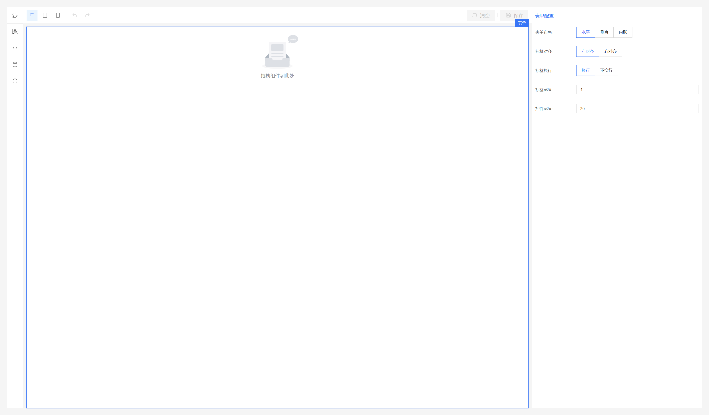
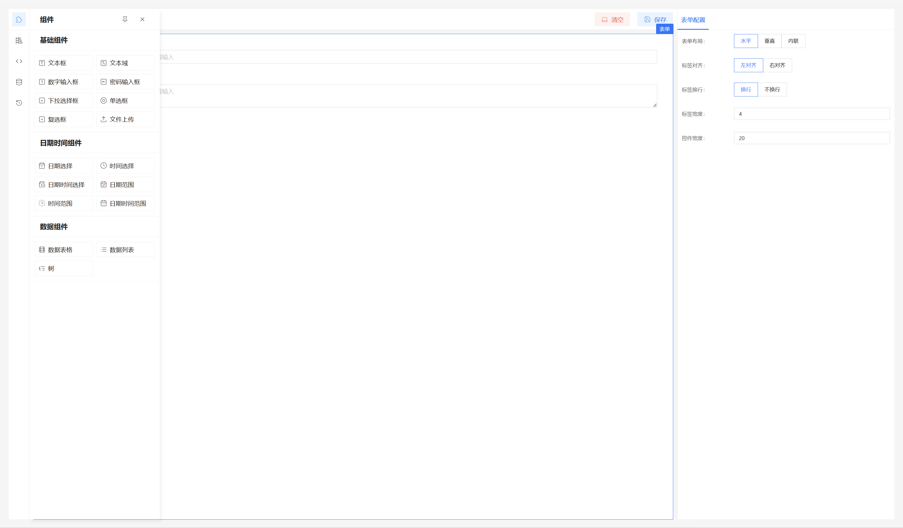
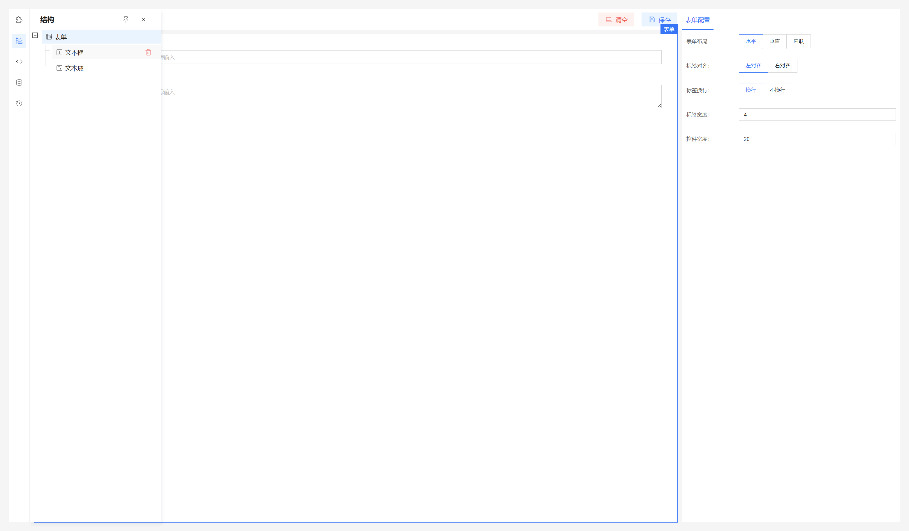
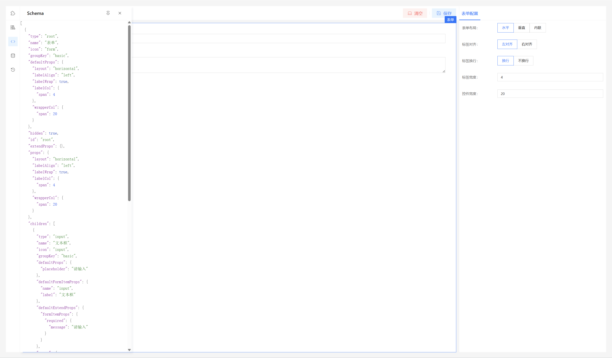
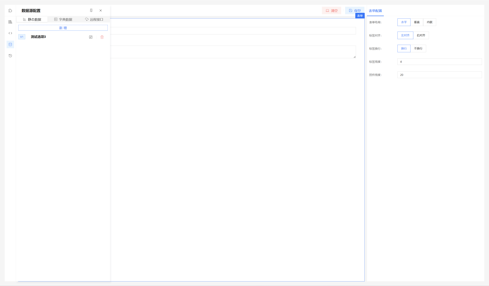
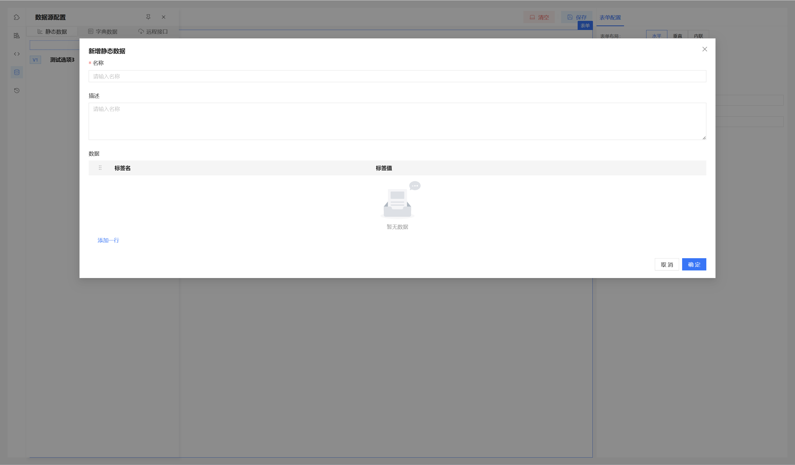
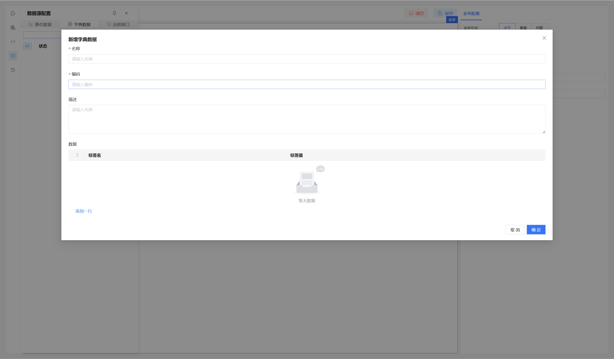
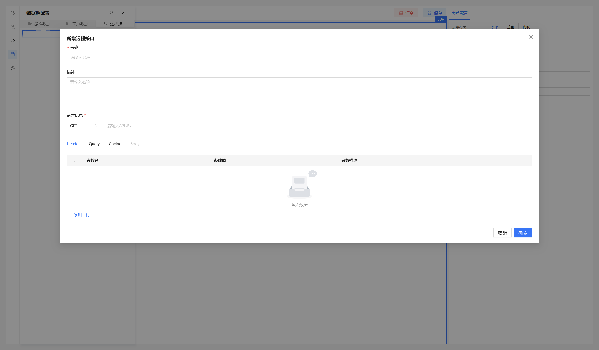
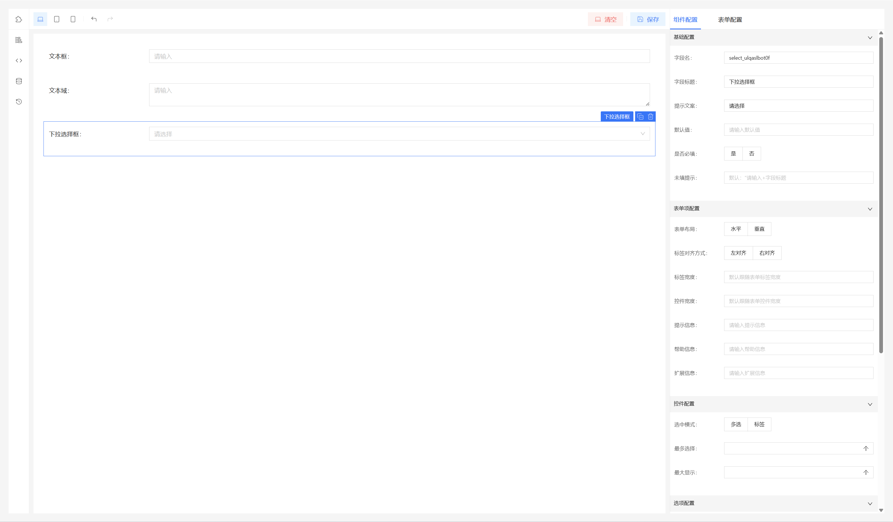

可视化表单、表单设计器、React表单设计器、React可视化表单、Antd表单设计器
## 一、简介  
一个比较简单的表单设计器，来自一个不务正业的Java程序员开发。看了很多优秀的表单设计器，奈何水平有限，文档也看着打脑壳，所以自己学着弄一个。  基于React18、Antd5开发。  
##  欢迎大佬扩展调优

## 二、放点预览图  
### 首页

### 组件面板

### 结构面板

### Schema面板

### 数据源面板

### 数据源面板-静态数据-新增

### 数据源面板-数据字典-新增

### 数据源面板-远程接口-新增

### 属性配置面板

